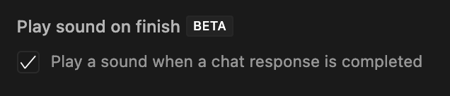

  

# 🚫 Deprecated!
Cursor added `Composer Boop`'s original functionality natively + changed some of the tech I was using to detect composer completions. Rather than fix this add-on, you should just use the new Cursor setting.

Just enable the the "Play Sound on Finish" option and you'll get your boop when composer is ready.

# Composer Boop

A VS Code extension that plays a sound notification when you stop typing in Cursor's composer window.

## Why?

Cursor's Composer / Chat is awesome, but I found it pretty hard to keep track of long-running updates (especially in agent mode!). I made this simple extension to give some feedback when there's an "Accept Change" prompt. It's been pretty helpful for me when multitasking while Cursor does its thing.

## Caveats

This is pretty jank due to VS Code's extension security model and the lack of a way to detect when Cursor's composer is open. In lieu of this, I'm just looking at change events on the chat / composer's code blocks. It's not 100% reliable, but it gets the job done.

Hoping that Cursor adds this feature natively soon!

## Features

- Plays a sound when you stop typing in Cursor's composer
- Customizable delay time
- Multiple sound options
- Adjustable volume
- Works on macOS, Windows, and Linux (untested on the latter two)

## Installation

1. Install from VS Code Marketplace
2. Or install the VSIX file manually:
   - Download the latest `.vsix` file from the releases
   - In VS Code, go to Extensions
   - Click "..." at the top and choose "Install from VSIX"

## Configuration

This extension can be configured through VS Code settings:

- `composerBoop.enabled`: Enable or disable the boop sound (default: true)
- `composerBoop.delayMs`: Delay in milliseconds before playing sound (default: 3000)
- `composerBoop.soundFile`: Choose the notification sound:
  - notification-bloop.wav
  - notification-click.wav
  - notification-jobs-done.wav
  - notification-pop.wav
- `composerBoop.volume`: Adjust sound volume from 0.0 to 1.0 (default: 1.0)

## Usage

1. Open Cursor
2. Start typing in the composer window
3. When you Cursor is ready for you to accept a change, you'll hear a notification sound after the configured delay

## Requirements

- Cursor

## Release Notes

### 0.0.1

Initial release:

- Basic sound notification functionality

## Development

1. Clone the repository
2. Run `npm install`
3. Press F5 to start debugging
4. Make changes and test
5. Package with `npm run package`

## License

MIT

## Contributing

Contributions are welcome! Please feel free to submit a Pull Request.
